# LSTM on distance functions


```python
from glob import glob
import json
from collections import defaultdict
import h5py
import pickle
from copy import deepcopy
import os

from keras.preprocessing.sequence import TimeseriesGenerator
import numpy as np
import pandas as pd
from keras.layers import LSTM, Dense, Activation, GaussianNoise
from keras.models import Input, Model
from keras.optimizers import Adam
import seaborn as sns
from matplotlib import pyplot as plt
from scipy.stats import energy_distance, wasserstein_distance
from sklearn.metrics import precision_score, recall_score, roc_auc_score

from canary.generator.utils import (
    buckets_to_points, X_metric_to_df, y_metric_to_df, buckets_to_points
)
from canary.models.metrics import (
    mse_times_100_tf, mse_times_100_np, log_bhattacharyya_dist, log_max_diff_dist, log_sum_of_diff_dist,
    log_wasserstein_dist, log_energy_dist
)
from canary.models.utils import percentile, plot_dists, plot_preds, calculate_dists
```

    Using TensorFlow backend.


## Load the data

Loading the data previously generated with `generator` module


```python
DATA_DIR = '/home/aga/canary/data/'
```


```python
X_train = dict()
for file in sorted(glob(os.path.join(DATA_DIR, '*_X_train.json'))):
    m = file.split('/')[-1].split('_X')[0]
    X_train[m] = json.load(open(file))
    
X_test = dict()
for file in sorted(glob(os.path.join(DATA_DIR, '*_X_test.json'))):
    m = file.split('/')[-1].split('_X')[0]
    X_test[m] = json.load(open(file))

y_anomalies = dict()
for file in sorted(glob(os.path.join(DATA_DIR, '*_y_test.json'))):
    m = file.split('/')[-1].split('_y')[0]
    y_anomalies[m] = json.load(open(file))
    
y_pred = dict()
for m, hist in X_test.items():
    y_pred[m] = dict.fromkeys(hist['data'], 0)

y_pred_proba = dict()
for m, hist in X_test.items():
    y_pred_proba[m] = dict.fromkeys(hist['data'], 0)
```

## Calculate the distances on train and test

First, we convert the data from histograms to distanced between next days as the LSTM works on the distances.

Calculated distances:
 - logarithm of Bhattacharyya distance
 - logarithm of Wasserstein distance
 - logarithm of energy distance
 - logarithm of maximum difference between corresponding buckets
 - logarithm of sum of difference between corresponding buckets
 
Logarithm is a form of normalization of the distances.
The distances were chosen arbitrary, the more diversed distances, the better.


```python
bucket_dists = [log_bhattacharyya_dist, log_max_diff_dist, log_sum_of_diff_dist]
points_dists = [log_wasserstein_dist, log_energy_dist]
```


```python
X_train_dists = {}
y_train_dists = {}
dists_train = calculate_dists(X_train, bucket_dists, points_dists)
for metric in X_train.keys():
    X_train_dists[metric] = np.transpose(
        np.array([dists_train[metric][func.__name__][:-1] for func in bucket_dists + points_dists])
    )
    y_train_dists[metric] = np.transpose(
        np.array([dists_train[metric][func.__name__][1:] for func in bucket_dists + points_dists])
    )
```


```python
X_test_dists = {}
y_test_dists = {}
dists_test = calculate_dists(X_test, bucket_dists, points_dists)
for metric in X_test.keys():
    X_test_dists[metric] = np.transpose(
        np.array([dists_test[metric][func.__name__][:-1] for func in bucket_dists + points_dists])
    )
    y_test_dists[metric] = np.transpose(
        np.array([dists_test[metric][func.__name__][1:] for func in bucket_dists + points_dists])
    )
```

Let's see one example of conversion between histogram (bottom) and distances (top) on the train set. We can clearly see the potential anomaly on the distance plot.


```python
metric = 'A11Y_CONSUMERS'
dists_df = pd.DataFrame(dists_train[metric])
plot_dists(dists_df, X_train[metric])
```


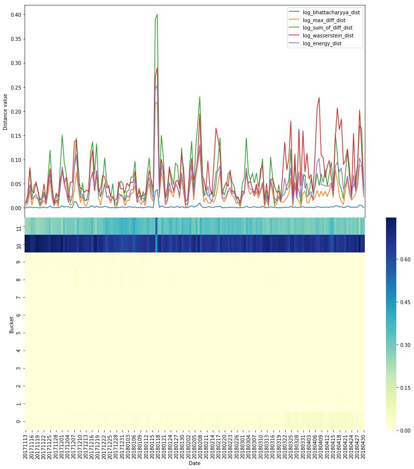


## Parameters for the model

- `N_UNIT` is the size of the hidden state in LSTM
- `LENGTH` is the length of one sequence fed to the model
- `BATCH_SIZE` is number of sequences fed to the model at the same time
- `STRIDE` is the offset between the subsequent sequences
- `NOISE` is standard deviation of the gaussian noise applied during training


```python
N_UNIT = 50
LENGTH = 14
BATCH_SIZE = 16
STRIDE = 7
NOISE = 5
```

## Delete too short merics

The train time series should be at least of length of `LENGTH + 2`, because we need some history to learn from.


```python
metrics = list(X_train_dists.keys())
for m in metrics:
    if X_train_dists[m].shape[0] < LENGTH + 2:
        del X_train_dists[m]
        del X_train[m]
        del X_test[m]
        del X_test_dists[m]
```

## Model declaration

The model declaration is a bit unusual. There are two models: `model_train` and `model_test`. The models share all of the layers, the only difference is the test model returns also the state of the LSTM. We need this for proper behaviour after detecting the anomaly.


```python
# Layers
lstm = LSTM(
    units=N_UNIT,
    return_sequences=True,
    return_state=True
)
dense = Dense(5)
noise = GaussianNoise(NOISE)

# model_train
input_train = Input(shape=(None, 5))
output_train = noise(input_train)
output_train, _, _ = lstm(output_train)
output_train = dense(output_train)
model_train = Model(inputs=[input_train], outputs=output_train)
model_train.compile(optimizer=Adam(lr=0.001), loss=mse_times_100_tf)

# model_test
input_test = Input(shape=(None, 5))
input_test_h = Input(shape=(N_UNIT,))
input_test_c = Input(shape=(N_UNIT,))
input_states = [input_test_h, input_test_c]
output_test, state_h, state_c = lstm(
    input_test, initial_state=input_states
)
output_states = [state_h, state_c]
output_test = dense(output_test)
model_test = Model(
    [input_test] + input_states,
    [output_test] + output_states,
)
model_test.compile(optimizer=Adam(lr=0.001), loss=mse_times_100_tf)

# batch generator
batch_gen_dict = {metric: iter(TimeseriesGenerator(
    X_train_dists[metric], y_train_dists[metric], 
    length=LENGTH + 1, stride=STRIDE, batch_size=BATCH_SIZE, shuffle=True,
    )) for metric in X_train.keys()}
```

## Training model

The model is trained on batches of size `BATCH_SIZE`, each observation is of length `LENGTH`. The model should predict the next day of data, so the ground truth is the same as train data, but moved one day forward.


```python
def train_model(model, batch_gen_dict, n_iter=1000):
    train_loss = []
    for i in range(n_iter):
        metric = np.random.choice(list(batch_gen_dict.keys()))
        X, _ = next(batch_gen_dict[metric])
        y = X[:, 1:, :]
        X = X[:, :-1, :]
        train_loss.append(model.train_on_batch(X, y))
        if i % 100 == 0:
            print('BATCH: ', i, 'MEAN LOSS: ', np.mean(train_loss[-100:]))
```


```python
train_model(model_train, batch_gen_dict, n_iter=10000)
```

    BATCH:  0 MEAN LOSS:  288.27438
    BATCH:  100 MEAN LOSS:  86.741905
    BATCH:  200 MEAN LOSS:  59.50758
    BATCH:  300 MEAN LOSS:  83.64087
    BATCH:  400 MEAN LOSS:  67.21536
    BATCH:  500 MEAN LOSS:  61.12997
    BATCH:  600 MEAN LOSS:  64.779274
    BATCH:  700 MEAN LOSS:  64.064606
    BATCH:  800 MEAN LOSS:  55.79419
    BATCH:  900 MEAN LOSS:  58.403152
    BATCH:  1000 MEAN LOSS:  43.731983
    BATCH:  1100 MEAN LOSS:  49.516823
    BATCH:  1200 MEAN LOSS:  54.0703
    BATCH:  1300 MEAN LOSS:  66.22446
    BATCH:  1400 MEAN LOSS:  47.606674
    BATCH:  1500 MEAN LOSS:  59.87509
    BATCH:  1600 MEAN LOSS:  58.653843
    BATCH:  1700 MEAN LOSS:  50.85111
    BATCH:  1800 MEAN LOSS:  56.308304
    BATCH:  1900 MEAN LOSS:  55.873566
    BATCH:  2000 MEAN LOSS:  52.192806
    BATCH:  2100 MEAN LOSS:  55.199825
    BATCH:  2200 MEAN LOSS:  53.34083
    BATCH:  2300 MEAN LOSS:  54.131016
    BATCH:  2400 MEAN LOSS:  57.843193
    BATCH:  2500 MEAN LOSS:  63.41438
    BATCH:  2600 MEAN LOSS:  36.385506
    BATCH:  2700 MEAN LOSS:  78.87158
    BATCH:  2800 MEAN LOSS:  62.230717
    BATCH:  2900 MEAN LOSS:  67.66799
    BATCH:  3000 MEAN LOSS:  58.913433
    BATCH:  3100 MEAN LOSS:  55.90421
    BATCH:  3200 MEAN LOSS:  58.81969
    BATCH:  3300 MEAN LOSS:  48.41405
    BATCH:  3400 MEAN LOSS:  50.6697
    BATCH:  3500 MEAN LOSS:  48.90187
    BATCH:  3600 MEAN LOSS:  69.31329
    BATCH:  3700 MEAN LOSS:  56.079433
    BATCH:  3800 MEAN LOSS:  61.26626
    BATCH:  3900 MEAN LOSS:  45.856247
    BATCH:  4000 MEAN LOSS:  61.316875
    BATCH:  4100 MEAN LOSS:  59.165585
    BATCH:  4200 MEAN LOSS:  57.70169
    BATCH:  4300 MEAN LOSS:  51.45319
    BATCH:  4400 MEAN LOSS:  55.626465
    BATCH:  4500 MEAN LOSS:  47.93315
    BATCH:  4600 MEAN LOSS:  49.382713
    BATCH:  4700 MEAN LOSS:  55.07328
    BATCH:  4800 MEAN LOSS:  38.81616
    BATCH:  4900 MEAN LOSS:  68.228645
    BATCH:  5000 MEAN LOSS:  37.133556
    BATCH:  5100 MEAN LOSS:  46.18476
    BATCH:  5200 MEAN LOSS:  38.011826
    BATCH:  5300 MEAN LOSS:  48.462036
    BATCH:  5400 MEAN LOSS:  46.179527
    BATCH:  5500 MEAN LOSS:  59.44861
    BATCH:  5600 MEAN LOSS:  53.21371
    BATCH:  5700 MEAN LOSS:  47.584103
    BATCH:  5800 MEAN LOSS:  52.267715
    BATCH:  5900 MEAN LOSS:  57.600952
    BATCH:  6000 MEAN LOSS:  49.97707
    BATCH:  6100 MEAN LOSS:  51.9656
    BATCH:  6200 MEAN LOSS:  67.12473
    BATCH:  6300 MEAN LOSS:  57.991344
    BATCH:  6400 MEAN LOSS:  55.48089
    BATCH:  6500 MEAN LOSS:  52.00143
    BATCH:  6600 MEAN LOSS:  61.249146
    BATCH:  6700 MEAN LOSS:  52.934605
    BATCH:  6800 MEAN LOSS:  58.248466
    BATCH:  6900 MEAN LOSS:  46.93274
    BATCH:  7000 MEAN LOSS:  48.16814
    BATCH:  7100 MEAN LOSS:  51.056664
    BATCH:  7200 MEAN LOSS:  44.823364
    BATCH:  7300 MEAN LOSS:  45.52724
    BATCH:  7400 MEAN LOSS:  62.20466
    BATCH:  7500 MEAN LOSS:  60.20248
    BATCH:  7600 MEAN LOSS:  41.102592
    BATCH:  7700 MEAN LOSS:  47.93047
    BATCH:  7800 MEAN LOSS:  53.746723
    BATCH:  7900 MEAN LOSS:  59.50234
    BATCH:  8000 MEAN LOSS:  51.85884
    BATCH:  8100 MEAN LOSS:  49.929825
    BATCH:  8200 MEAN LOSS:  65.27017
    BATCH:  8300 MEAN LOSS:  70.14023
    BATCH:  8400 MEAN LOSS:  46.572372
    BATCH:  8500 MEAN LOSS:  57.861393
    BATCH:  8600 MEAN LOSS:  57.56114
    BATCH:  8700 MEAN LOSS:  51.56667
    BATCH:  8800 MEAN LOSS:  48.215538
    BATCH:  8900 MEAN LOSS:  47.33447
    BATCH:  9000 MEAN LOSS:  53.415295
    BATCH:  9100 MEAN LOSS:  38.1257
    BATCH:  9200 MEAN LOSS:  63.629223
    BATCH:  9300 MEAN LOSS:  70.528595
    BATCH:  9400 MEAN LOSS:  51.21258
    BATCH:  9500 MEAN LOSS:  53.712055
    BATCH:  9600 MEAN LOSS:  57.01771
    BATCH:  9700 MEAN LOSS:  48.604008
    BATCH:  9800 MEAN LOSS:  55.66743
    BATCH:  9900 MEAN LOSS:  61.317417


## Calculate train losses

The observation is claimed to be an anomaly if the model loss is much higher on test observation than it was for training set. Because of that the losses on the train set have to calculated first.


```python
train_losses = defaultdict(list)
for metric in X_train.keys():
    X = np.expand_dims(X_train_dists[metric], 0)
    pred = model_train.predict(X)
    y_pred = np.squeeze(pred, 0)
    y_true = y_train_dists[metric]
    train_losses[metric] = [mse_times_100_np(y_t, y_p) for y_t, y_p in zip(y_true, y_pred)]
```


```python
ex_metric = 'CHECKERBOARD_PEAK'
plt.hist(train_losses[metric], bins=50)
plt.title('Example losses on train set')
plt.xlabel('MSE times 100')
plt.ylabel('Count')
plt.show()
```


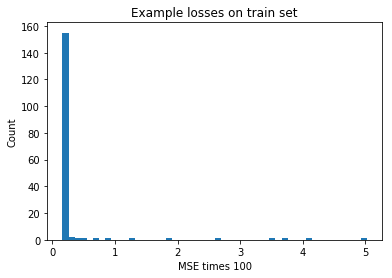


## Predict on test and calculate ROC AUC

The prediction is made first on the train set, so the LSTM can learn given metric and have a good hidden state. Then the prediction is made on the test set, but the anomalies are skipped, so the model won't try to predict the next day based on an anomaly.


```python
def predict_test(model, X_train, X_test, y_train, y_test, losses_train, metric, threshold=0.99):
    anomaly = False
    X_dist_copy = deepcopy(X_test)
    y_dist_copy = deepcopy(y_test)
    state_h, state_c = np.zeros((1, 50)), np.zeros((1, 50))
    preds = []
    pred_proba = []
    pred_anom = []
    
    # prediction on train
    for day in X_train:
        expanded_day = np.expand_dims(np.expand_dims(day, 0), 0)
        pred, state_h, state_c = model.predict([expanded_day, state_h, state_c])

    # prediction on test with skipping anomalies
    for i, day in enumerate(X_dist_copy):
        if anomaly:
            day = old_day
            anomaly = False
        expanded_day = np.expand_dims(np.expand_dims(day, 0), 0)
        pred, state_h, state_c = model.predict([expanded_day, state_h, state_c])
        squeezed_pred = np.squeeze(np.squeeze(pred, 0), 0)
        preds.append(squeezed_pred)
        loss = mse_times_100_np(y_dist_copy[i], squeezed_pred)
        proba = percentile(losses_train[metric], loss)
        pred_proba.append(proba)
        pred_anom.append(int(proba > threshold))
        if proba > threshold:
            try:
                anomaly = True
                old_day = day
                X_dist_copy[i + 2] = np.abs(X_dist_copy[i + 2] - X_dist_copy[i + 1])
                y_dist_copy[i + 1] = np.abs(y_dist_copy[i + 1] - y_dist_copy[i])
            except IndexError:
                pass
    return X_dist_copy, preds, pred_proba, pred_anom
```


```python
auc_list = []

for i, m in enumerate(X_test.keys()):
    try:
        X_test_dist_tmp, pred, pred_proba, pred_anom = predict_test(
            model_test, X_train_dists[m], X_test_dists[m], 
            y_train_dists[m], y_test_dists[m], train_losses, m
        )

        # Make data frames
        X_test_df = X_metric_to_df(X_test[m]).iloc[:, 2:]
        y_df = pd.DataFrame(y_test_dists[m])
        y_anom_df = y_metric_to_df(y_anomalies[m]).iloc[2:, ]
        y_pred_df = pd.DataFrame(pred_anom)
        y_pred_proba_df = pd.DataFrame(pred_proba)
    
    except KeyError:
        print(m)
        continue

    # Check if there are two classes in test set, AUC is not defined otherwise
    if len(np.unique(np.array(y_anom_df[0]))) > 1:
        auc_score = roc_auc_score(np.array(y_anom_df.iloc[:, 0]), np.array(y_pred_proba_df.iloc[:, 0]))
        auc_list.append(auc_score)

        if i % 200 == 0:
            print('metric: ', m)
            print('auc: ', auc_score)
            plot_preds(X_test_df, y_anom_df, y_pred_df)
```

    metric:  A11Y_CONSUMERS
    auc:  0.9923986486486487


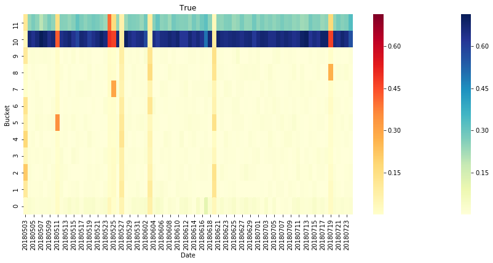


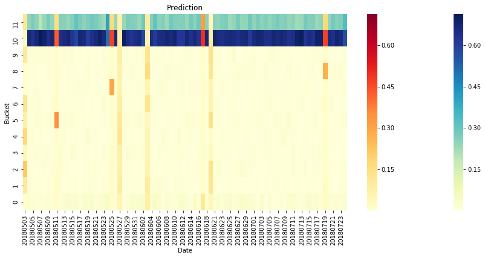


    metric:  DEVTOOLS_PERFTOOLS_CONSOLE_RECORDING_COUNT
    auc:  0.7777777777777778


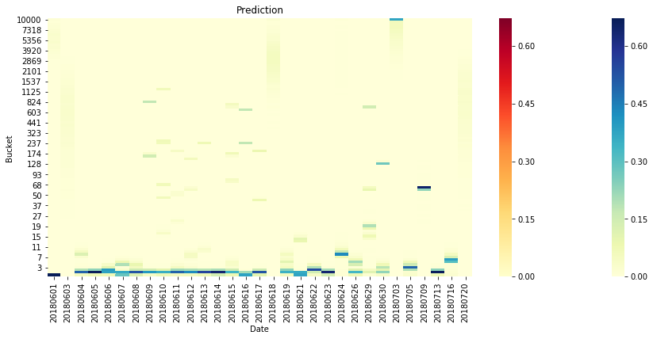


    metric:  GC_BUDGET_OVERRUN
    auc:  0.8834827144686299


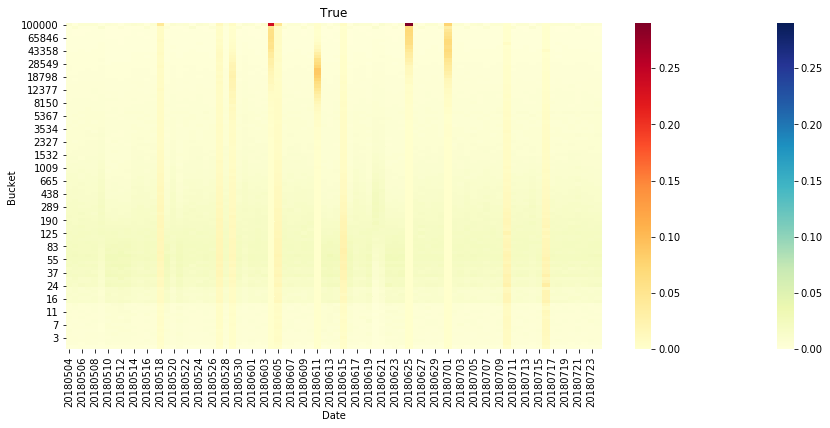


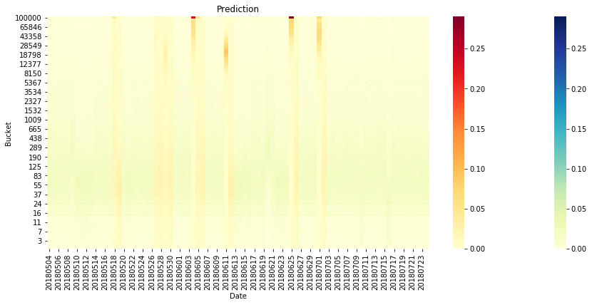


    metric:  MEMORY_DISTRIBUTION_AMONG_CONTENT
    auc:  0.9551856594110115


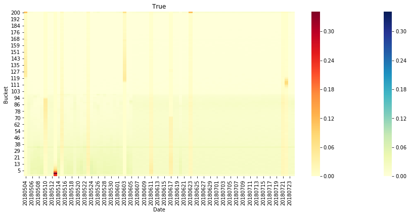


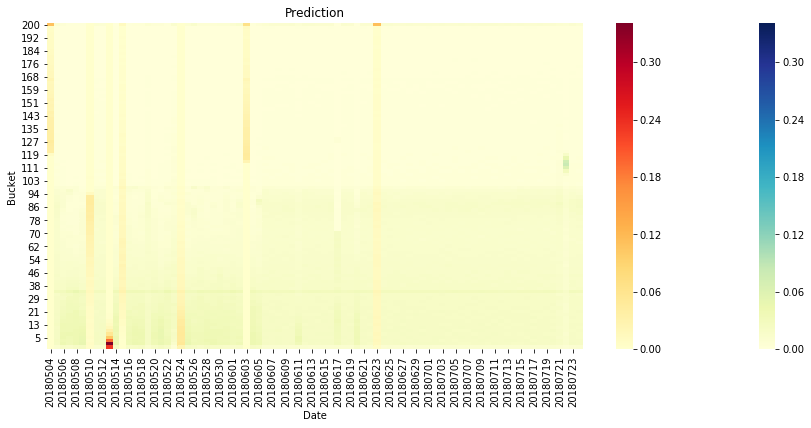


    metric:  PWMGR_MANAGE_COPIED_PASSWORD
    auc:  0.5041666666666667


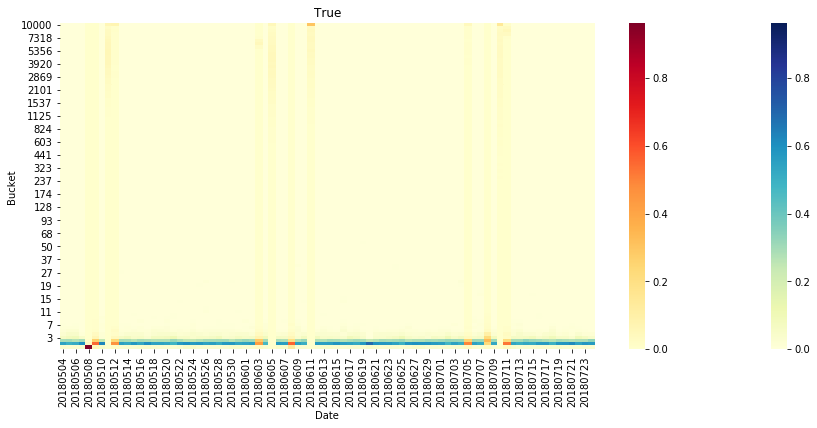


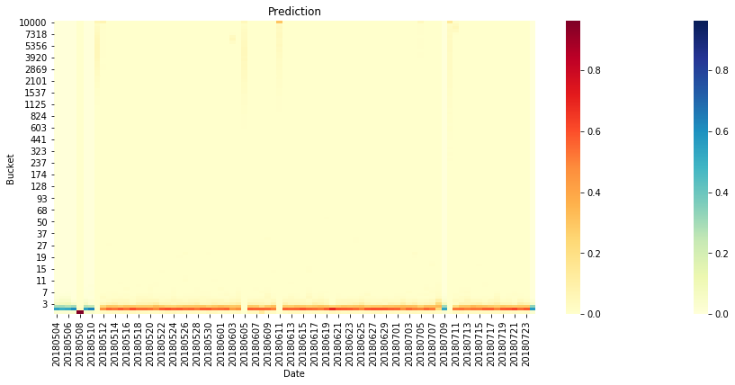


    SHUTDOWN_PHASE_DURATION_TICKS
    SIMPLE_MEASURES_ADDONMANAGER
    SIMPLE_MEASURES
    metric:  SSL_AUTH_ECDSA_CURVE_FULL
    auc:  0.6942567567567568


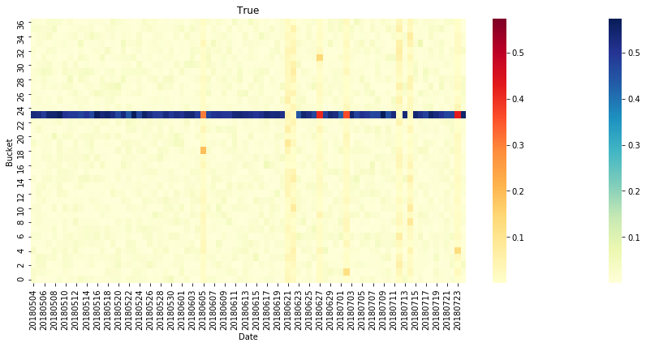


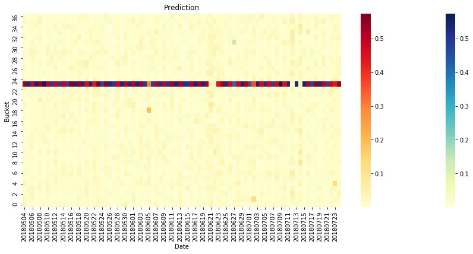


    metric:  URLCLASSIFIER_LOOKUP_TIME_2
    auc:  0.639269406392694


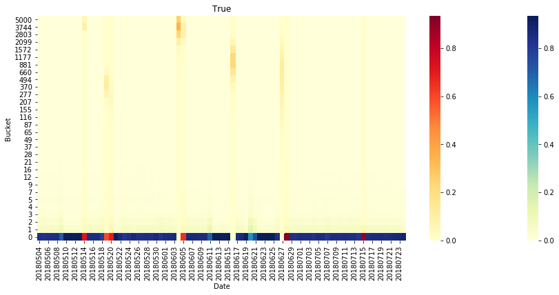


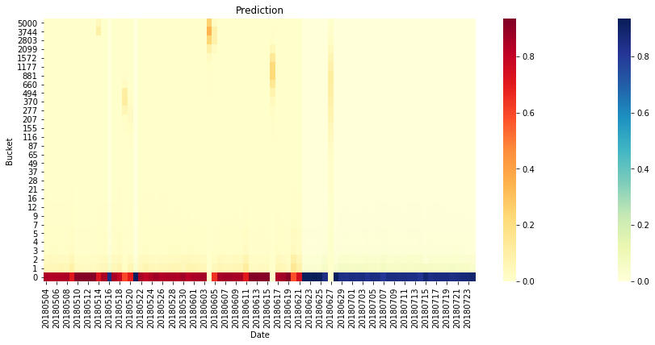


    USE_COUNTER2_DEPRECATED
    metric:  USE_COUNTER2_OFFLINERESOURCELIST_ONUPDATEREADY_getter_PAGE
    auc:  0.7837837837837838


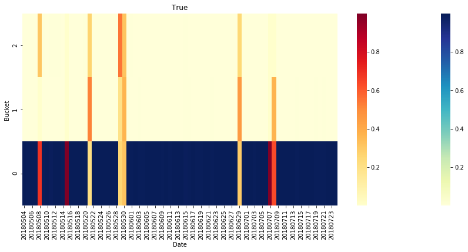


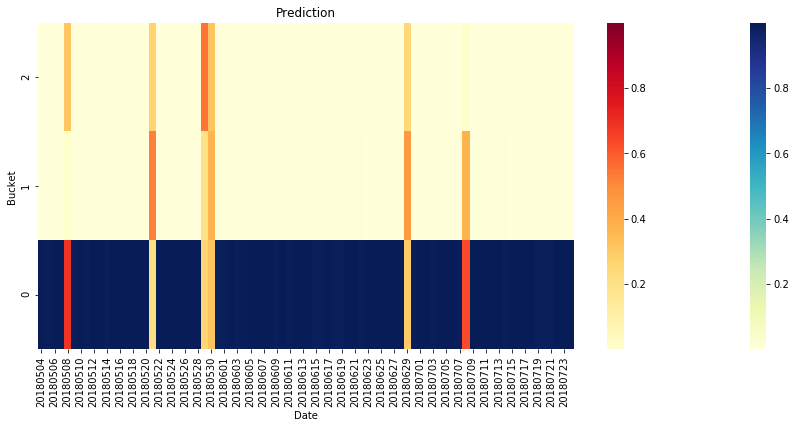


    USE_COUNTER2


```python
print('Mean ROC AUC: ', np.mean(auc_list))
```

    Mean ROC AUC:  0.8084029525027528


The average ROC AUC for all metrics is 0.81.
